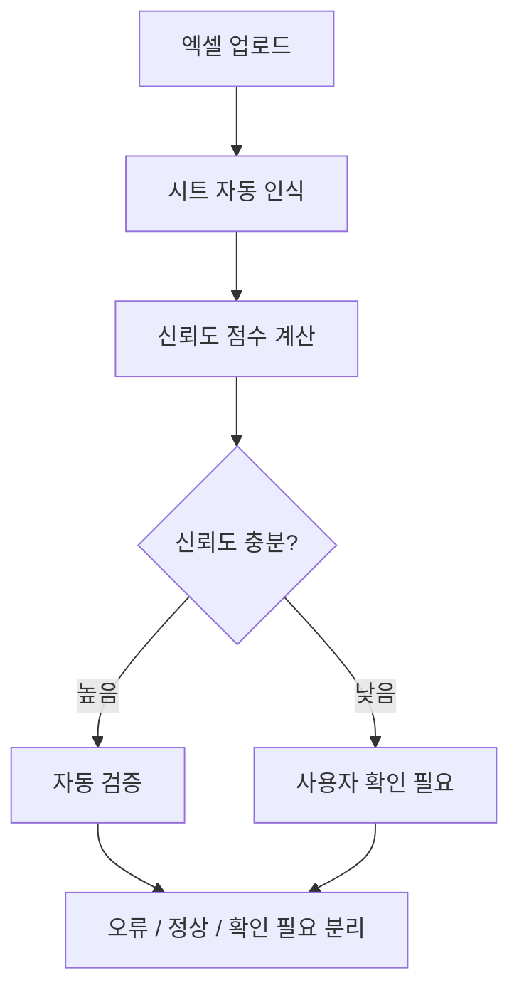
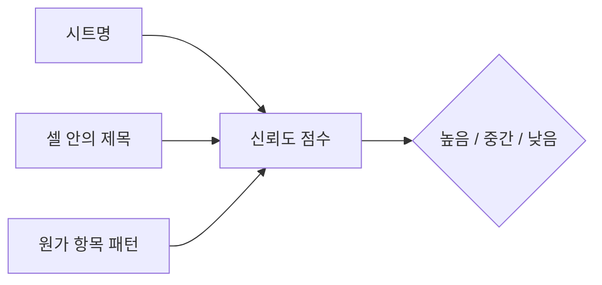
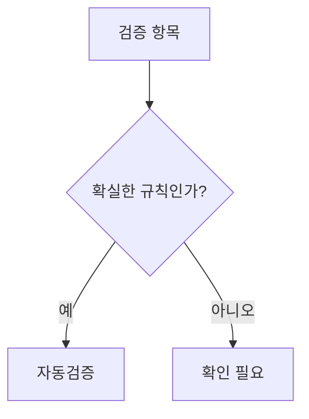
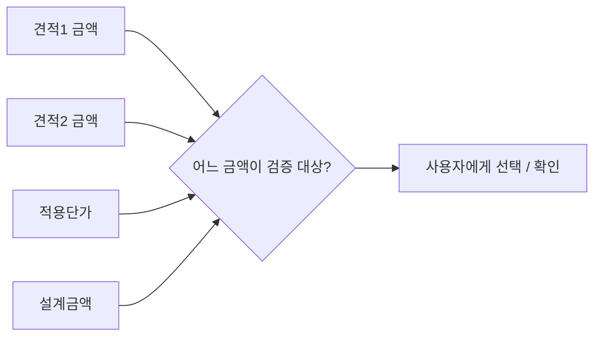
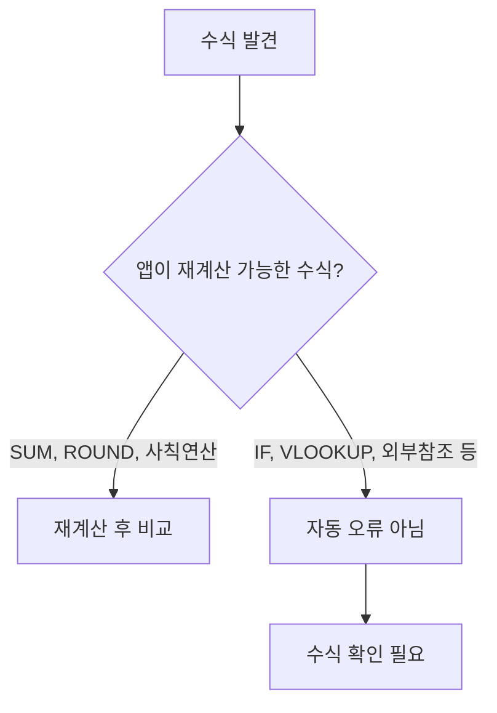
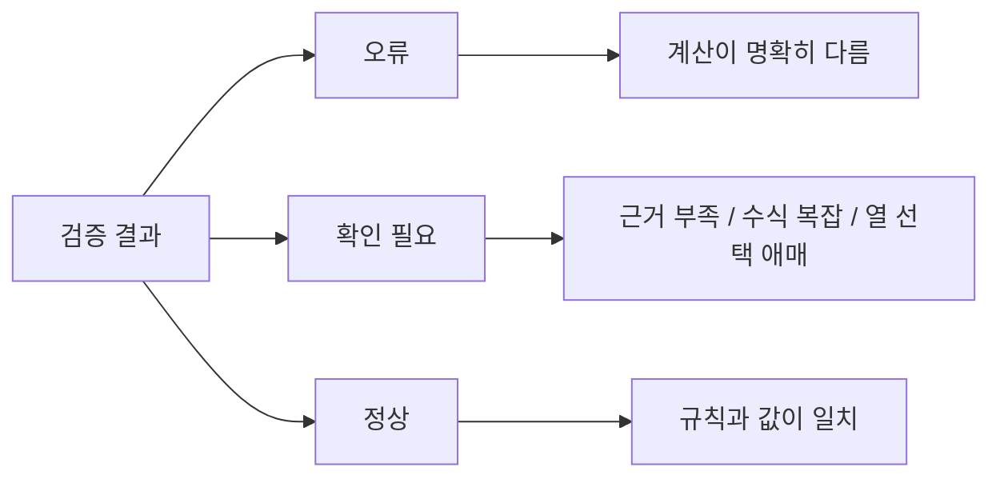
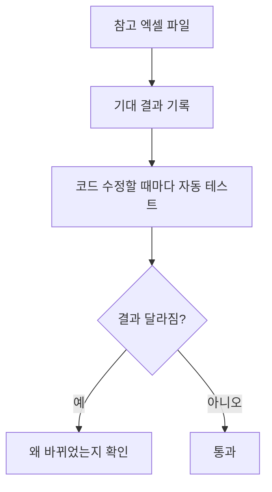

# 원가계산서 파싱 오류 줄이는 방법

이 문서는 원가계산서 Excel 파일을 자동 분석할 때 오탐과 누락을 줄이는 방법을 쉽게 설명합니다.

핵심은 하나입니다.

**앱이 모르는 것을 아는 척하지 않게 만들기.**

확실한 것은 자동검증하고, 애매한 것은 `확인 필요`로 분리해야 합니다.

**캡션:**  
오류를 줄이려면 모든 것을 무조건 자동 판정하지 말고, 확실할 때만 자동검증해야 합니다.

---

## 1. 시트 인식에 신뢰도 점수 붙이기

지금처럼 시트명만 보고 판단하면 위험합니다. 실제 파일에는 `Sheet1`, `첨부7-3`, `건축제비율(8.9.)`처럼 이름만 봐서는 애매한 시트가 많습니다.

앱은 아래 정보를 함께 봐야 합니다.

| 판단 근거 | 신뢰도 |
|---|---:|
| 시트명에 `원가계산서`가 있음 | 높음 |
| 셀 안에 `직접재료비`, `직접노무비`, `경비`, `일반관리비`, `이윤`이 있음 | 높음 |
| `부가가치세`, `공급가액`, `합계`가 있음 | 중간 |
| 단어 몇 개만 우연히 있음 | 낮음 |

**캡션:**  
앱이 왜 이 시트를 원가계산서라고 판단했는지 근거를 남기면, 오인식을 줄이고 사람이 검토하기 쉬워집니다.

---

## 2. 자동검증 대상과 확인 대상을 나누기

모든 항목을 같은 방식으로 검증하면 오탐이 늘어납니다.

| 구분 | 처리 방식 |
|---|---|
| 합계, 부가세, 단순 산식 | 자동검증 |
| 산재보험료, 고용보험료, 일반관리비, 이윤 | 기준요율이 있으면 자동검증 |
| 견적비교표의 적용금액 열 | 사용자 확인 후 검증 |
| 복잡한 수식 | 확인 필요 |
| 외부참조, 숨은 시트 참조 | 확인 필요 |

**캡션:**  
틀릴 가능성이 있는 항목은 바로 오류라고 단정하지 않고 확인 대상으로 분리합니다.

---

## 3. 금액 열을 자동으로 단정하지 않기

견적비교표는 특히 위험합니다. 같은 행에 여러 금액 열이 함께 있을 수 있습니다.

**캡션:**  
`견적1`, `견적2`, `적용단가`, `설계금액`이 같이 있으면 앱이 혼자 검증 대상을 결정하면 안 됩니다.

---

## 4. 계산식은 지원 가능 / 미지원을 분리하기

앱이 직접 재계산할 수 있는 수식과 그렇지 않은 수식을 구분해야 합니다.

**캡션:**  
앱이 못 푸는 복잡한 수식을 오류로 찍으면 오탐이 늘어납니다. 이런 수식은 `확인 필요`로 보내야 합니다.

---

## 5. 원가 항목 사전을 계속 키우기

기관과 양식마다 같은 항목을 다르게 부릅니다. 항목명 사전이 정확도에 직접 영향을 줍니다.

| 표준명 | 함께 잡아야 할 표현 |
|---|---|
| 산업안전보건관리비 | 안전보건관리비, 산안비 |
| 국민건강보험료 | 건강보험료 |
| 노인장기요양보험료 | 장기요양보험료 |
| 퇴직공제부금비 | 퇴직공제, 공제부금 |
| 공사손해보험료 | 손해보험료 |
| 부가가치세 | 부가세, VAT |

**캡션:**  
처음부터 모든 표현을 맞히기는 어렵습니다. 실제 파일을 볼수록 사전을 키워야 합니다.

---

## 6. 검증 결과를 3단계로 보여주기

`오류`와 `확인 필요`를 섞으면 사용자가 결과를 믿기 어렵습니다.

**캡션:**  
명확히 틀린 것만 `오류`로 표시하고, 애매한 것은 `확인 필요`로 분리해야 신뢰도가 올라갑니다.

---

## 7. 샘플 파일로 회귀테스트 만들기

지금 갖고 있는 참고 Excel 파일들은 좋은 테스트 자산입니다. 한 번 잘 되던 파일이 나중에 깨지지 않게 자동 테스트로 묶어야 합니다.

**캡션:**  
샘플 파일을 기준으로 자동 테스트를 만들면, 파서를 고치다가 기존 인식률이 떨어지는 문제를 빨리 잡을 수 있습니다.

---

## 추천 적용 순서

1. `오류 / 확인 필요 / 정상`을 확실히 나누기
2. 시트 인식 신뢰도 점수 만들기
3. 대용량 파일에서 중요 시트는 전체 스캔하기
4. 항목명 사전 확장하기
5. 참고 파일로 자동 테스트 만들기

---

## 한 줄 정리

**오류를 줄이는 최고의 방법은 앱이 모르는 것을 아는 척하지 않게 만드는 것입니다.**

확실한 것은 자동검증하고, 애매한 것은 사람에게 확인시키는 구조가 가장 안전합니다.
